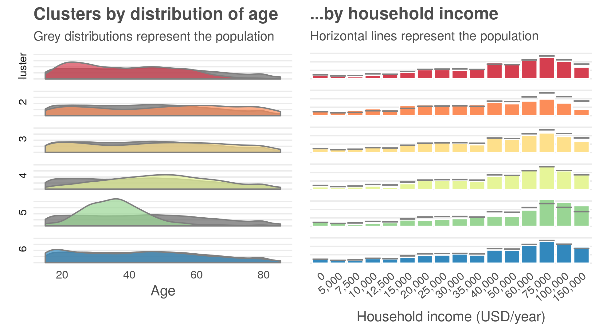

```{r setup, include=FALSE}
knitr::opts_chunk$set(echo = FALSE)
knitr::opts_chunk$set(message = FALSE)
knitr::opts_chunk$set(warning = FALSE)
knitr::opts_knit$set(root.dir = normalizePath(".."))
```


# Introduction and research question

What are your plans for the weekend? While it is easy to imagine that American’s spend their weekends differently, this is a challenging question to empirically validate. 

What are your plans for the weekend? Describing the average American’s weekend plans in an easy exercise in descriptive statistics. On average, the typical American sleeps 10 hours sleeping, 6 hours socializing and relaxing, 2 hours on household activities and 1 hour eating and drinking. This picture of how the average weekend is spent is shown in the plot below. 


While this plot speaks to the population average, it provides little relevant information about how actual individuals spend their time. Moreover, averages and traditional supervised methods are not designed to identify patterns of how different groupings of Americans fill their weekends. 

The idea that different people spend their weekends in different ways is unsurprising but it is hard to quantify.  Unsupervised machine learning, also referred to as cluster analysis, or clustering, offers a solution to these types of unstructured problems. The method applies distance metrics and linear algebra to recognize patterns and can quantify if different groups of Amerians spend their weekends in different ways. 

Data on time use was obtained from the American Time Use Survey (ATUS), which measures how Americans spend their time doing various activities such as work, household activities, volunteering, leisure, and socializing. The ATUS is the most comprehensive measure of time use and obtains a representative sample of how Americans spend their day. 


# Key findings
Duis aute irure dolor in reprehenderit in voluptate velit esse cillum dolore eu fugiat nulla pariatur. Excepteur sint occaecat cupidatat non proident, sunt in culpa qui officia deserunt mollit anim id est laborum.

key points on data not yet mentioned
 - weekend only
 - going to examine a weighted samplen of 25k


# Analysis

## Distance

Clustering algorithms rely on calculating measures of distance between data points and variables. There are several established metrics such as the euclidean, manhattan, Jacquard and many others. As a starting point, it is useful to examine the distances between variables to understand if an underlying relationship exists. 

The distance matrix confirms some simple assumptions. For example, those who work more on the weekend spend less time sleeping. Similarly, those who work more on weekends have less social and leisure time. While these simple comparisons confirm the assumption that patterns exist they do not reveal any underlying complex structure. 

\  


## Clustering

Hierarchical clustering extends the use of distance metrics to understand the similarities and differences between data points (i.e. the people), rather than the distance between variables. A powerful way to visualize this distance is by plotting a dendrogram of the clusters. Hierarchical clustering groups observations by iteratively reducing the number of clusters by combining data points. Dendrograms are a way of visualizing these relationships and identifying existing groupings. In this context, branches that are closer to one another represent people with more similar weekends.


## Choosing number of clusters

Identifying the final number of clusters is a nuanced and subjective exercise. That being said, mathematical and quantitative guidelines exist to aid this decision. To determine the number of groups the Calinski-Harabasz index, Silhouette width and Gap-statistic were consulted. 

These metrics, combined with the visualization provided by the dendrogram suggest that American’s weekend activities can be divided into 6 distinct clusters. Of the 6 final clusters, 5 represent distinct groupings while the 6th appears to be more general. 


Hierarchical clustering is only one of many clustering methods. We considered the popular K-means algorithm as well as model based clustering. A hierarchical approach offered the best fit to this particular data set. Within the Time Use Survey, many respondents indicate 0 minutes spent on several activities. The K-means algorithm assumes all variables have an equal variance and does not handle zero inflated variables well. These assumptions do not fit the specifics of time use. Similarly , model based clustering has more rigid assumptions that variables come from a multivariate normal data generating process. Hierarchical clustering avoids these assumptions and is a good fit for this particular clustering problem. 

Frequently, variables are scaled prior to cluster analysis. In this particular context, variables are already recorded on the same scale so no centering or transformations were included and variables were left in their original non-transformed format. 

# Breaking down the clusters

## Activities
After assigning each person to a cluster, different groupings of weekend activities begin to emerge. Shown below, while all 6 groupings spend approximately equal time sleeping, there are distinct differences in the amount of time spent working, time spent on household activities, differences in socialization and differing amounts of time spent caring for other members of ones’ household. In the plot, each row represents a distinct cluster and colors denote different activities. 

\  


To get a better understanding of each cluster, the plot below focuses on the most distinct differences in time spent between each cluster. Differences in these five primary activities account for the majority  of differences in how American’s spend their weekends. These results show that the algorithm is able to identity those who spend their weekends predominantly working (Cluster 1), socializing (Clusters 2 & 3), on household activities (Cluster 4) and on caring for other members of the household (Cluster 5)

\  


## Who makes up each cluster? 

One of the values of cluster analysis is the ability to identify who makes up segments of the broader population. By linking cluster assignment to data from the Current Population Survey (CPS) a better picture of differences between clusters can be drawn. 

\  

> **Why explore demographic data?**  
> Linking demographic data to cluster assignment has many different uses that range from marketing to academic research. For example, a long line of research has shown that women spend more time taking care of household members compared to their male counterparts. Investigating demographic associations with cluster assignment could be used as a tool to validate that women disproportionately spend more hours on unpaid work. In a different context, marketing firms could improve targeted advertisements by identifying segments that spend their weekends on different types of activities.

\  

Comparing age, income, marital status, sex, children and eduational atainment between clusters revealed several patterns. While each cluster is made up of all demographics, demographics within each of the first five clusters differ from population averages.  The visual below shows how age and income are not evenly dispersed between clusters. Some clusters tend to be younger, others are largely middle aged and others skew older. Similar differences exist for different levels of household income. 

\  



Similarly, we see uneven dispersions in sex, marital status, children, and education levels. Some clusters skew towards female, others contain more married individuals, and others more education. Notably, cluster 5 contains almost exclusively individuals that have children in the household.

\  


Comparing cluster assignment against demographic variables allows up to characterize which Americans make up the majority of each cluster. A brief demographic description of each cluster is provided below: 

### Cluster 1
The first cluster 
Young/kids majority sub 25 working on the weekend like usual. Even income and gender. 

### Cluster 2
Older people lower income spend time socializing, relaxing and leisure

### Cluster 3
Slightly older group but less male than cluster 2, less children, more educated and spend time socializing and on leisure. 

### Cluster 4
Stay at home moms, middle age, spend a lot of time on housework and are married and do not have kids in the household. Educated empty nesters

### Cluster 5
Stay at home moms 20-40 and spend a lot of time taking care of others. Highly educated and married. 

### Cluster 6
Everyone else 


# Conclusion

Lorem ipsum dolor sit amet, consectetur adipiscing elit, sed do eiusmod tempor incididunt ut labore et dolore magna aliqua. Ut enim ad minim veniam, quis nostrud exercitation ullamco laboris nisi ut aliquip ex ea commodo consequat. Duis aute irure dolor in reprehenderit in voluptate velit esse cillum dolore eu fugiat nulla pariatur. Excepteur sint occaecat cupidatat non proident, sunt in culpa qui officia deserunt mollit anim id est laborum.

Lorem ipsum dolor sit amet, consectetur adipiscing elit, sed do eiusmod tempor incididunt ut labore et dolore magna aliqua. Ut enim ad minim veniam, quis nostrud exercitation ullamco laboris nisi ut aliquip ex ea commodo consequat. Duis aute irure dolor in reprehenderit in voluptate velit esse cillum dolore eu fugiat nulla pariatur. Excepteur sint occaecat cupidatat non proident, sunt in culpa qui officia deserunt mollit anim id est laborum.

