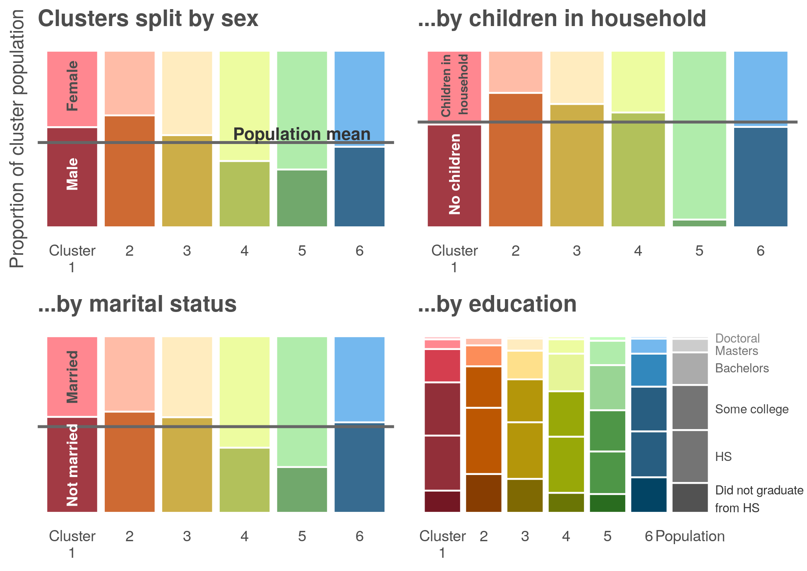

```{r setup, include=FALSE}
knitr::opts_chunk$set(echo = FALSE)
knitr::opts_chunk$set(message = FALSE)
knitr::opts_chunk$set(warning = FALSE)
knitr::opts_knit$set(root.dir = normalizePath(".."))
```

\pagebreak

# Introduction and research question

What are your plans for the weekend? While it is easy to imagine that Americans spend their weekends differently, this is a challenging question to empirically validate. 

Describing the average American’s weekend plans in an easy exercise in descriptive statistics. On average, the typical American sleeps 10 hours sleeping, six hours socializing and relaxing, two hours on household activities and one hour eating and drinking. This picture of how the average weekend is shown in the plot below. 

\  


This plot describes the population average, but provides little relevant information about how actual individuals spend their time. The idea that different people spend their weekends in different ways is unsurprising but it is hard to quantify.  Unsupervised machine learning, also referred to as cluster analysis or clustering, offers a solution to these types of unstructured problems. The method applies distance metrics and linear algebra to recognize patterns, and can quantify if different groups of Americans spend their weekends in different ways. 

Data on time use was obtained from the [American Time Use Survey](https://www.bls.gov/tus/) (ATUS), which measures how Americans spend their time doing various activities such as work, household activities, volunteering, leisure, and socializing. The ATUS is the most comprehensive measure of time use and obtains a representative sample of how Americans spend their day. 

\  

> **The data and sampling**  
> The cluster analysis used 16 years of ATUS data totaling to a sample of over 201,000 unique Americans. Filtering out responses to only include time spent on the weekend left a sample of approximately 100,000 unique people. Cluster analysis is a computationally expensive procedure, and including the entire sample in the analysis was not feasible. To maintain a representative sample of the American population, survey weights were used to draw 25,000 individuals to be included in the analysis. 

# Key findings

The final cluster solution was able to identify six unique clusters, five of which were characterized by uniquely different activity patterns compared to the general population. The sixth cluster appeared to characterize the “average” American weekend. 

Broadly speaking, considerable differences in time spent working, on social and leisure activity, on household activities (i.e. home maintenance) and on taking care of other members of the household were uncovered. For example, one cluster spent 6.6x time working compared to the population average and another spent 7.7x time caring for other household members. These results suggests that there are distinct differences in weekend activities and that these differences can be empirically identified. 


# Analysis

## Distance metric

Clustering algorithms rely on calculating measures of distance between data points and variables. There are several established metrics such as the [Euclidean](https://hlab.stanford.edu/brian/euclidean_distance_in.html), [Manhattan](https://www.cs.cornell.edu/courses/JavaAndDS/files/manhattanDistance.pdf), [Mahalanobis](http://cis.csuohio.edu/~sschung/CIS660/MahalanobisDistance.pdf) and many others. As a starting point, it is useful to examine the distances between variables to understand if an underlying relationship exists. 

The distance matrix confirms some simple assumptions. For example, those who work more on the weekend spend less time sleeping. Similarly, those who work more on weekends have less social and leisure time. While these simple comparisons confirm the assumption that patterns exist they do not reveal any underlying complex structure. 

\  


## Hierarchical clustering and visualizing the relationships 

Hierarchical clustering extends the use of distance metrics to understand the similarities and differences between data points (i.e. the people), rather than the distance between variables. A powerful way to visualize this distance is by plotting a dendrogram of the clusters. Hierarchical clustering groups observations by iteratively reducing the number of clusters by combining data points. Dendrograms are a way of visualizing these relationships and identifying existing groupings. In this context, branches that are closer to one another represent people with more similar weekends.


## Choosing the right number of clusters

Identifying the final number of clusters is a nuanced and subjective exercise. That being said, mathematical and quantitative guidelines exist to aid this decision. To determine the number of groups the Calinski-Harabasz index, Silhouette width and Gap-statistic were consulted. 

These metrics, combined with the visualization provided by the dendrogram suggest that American’s weekend activities can be divided into six distinct clusters. Of the six final clusters, five represent distinct groupings while the sixth appears to be more general. 


Hierarchical clustering is only one of many clustering methods. We considered the popular K-means algorithm as well as model-based clustering. A hierarchical approach offered the best fit to this particular data set. Within the Time Use Survey, many respondents indicate zero minutes spent on several activities. The K-means algorithm assumes all variables have an equal variance and does not handle zero-inflated variables well. These assumptions do not fit the specifics of time use. Similarly, model based clustering has more rigid assumptions that variables come from a multivariate normal data generating process. Hierarchical clustering avoids these assumptions and is a good fit for this particular clustering problem. 

Frequently, variables are scaled prior to cluster analysis. In this particular context, variables are already recorded on the same scale so no centering or transformations were included and variables were left in their original untransformed format. 

# Examining the clusters

## What activities define each cluster?

After assigning each person to a cluster, different groupings of weekend activities begin to emerge. Shown below, while all six clusters spent approximately equal time sleeping, there are distinct differences in the amount of time spent working, time spent on household activities, differences in socialization and differing amounts of time spent caring for other members of ones’ household. In the plot, each row represents a distinct cluster and colors denote different activities. 

\  


To get a better understanding of each cluster, the plot below focuses on the most distinct differences in time spent between each cluster. Differences in these four primary activities account for the majority  of differences in how American’s spend their weekends. These results show that the algorithm is able to identity those who spend their weekends predominantly working (Cluster 1), socializing (Clusters 2 & 3), on household activities (Cluster 4) and on caring for other members in the household (Cluster 5).

\  


## Who makes up each cluster? 

One of the values of cluster analysis is the ability to identify who makes up segments of the broader population. By linking cluster assignment to data from the Current Population Survey (CPS) a better picture of differences between clusters can be drawn. 

\  

> **Why explore demographic data?**  
> Linking demographic data to cluster assignment has many different uses that range from marketing to academic research. For example, a long line of research has shown that women spend more time taking care of household members compared to their male counterparts. Investigating demographic associations with cluster assignment could be used as a tool to validate that women disproportionately spend more hours on unpaid work. In a different context, marketing firms could improve targeted advertisements by identifying segments that spend their weekends on different types of activities.

\  

Comparing age, income, sex, children, marital status, and educational attainment between clusters revealed several patterns. While each cluster is made up of all demographics, demographics within each of the first five clusters differ from population averages. The visual below shows how age and income are not evenly dispersed between clusters. Some clusters tend to be younger, others are largely middle-aged and others skew older. Similar differences exist for different levels of household income. 

\  


Similarly, we see uneven dispersion in sex, marital status, children, and education levels. Some clusters skew towards female, others contain more married individuals, and others more education. Notably, Cluster 5 contains almost exclusively individuals that have children in the household.



## Cluster summaries

Comparing cluster assignment against demographic variables allows up to characterize which Americans make up the majority of each cluster. A brief demographic description of each cluster is provided below: 

### Cluster 1
- Those in Cluster 1 spent the most time working. With an average of 8 hours and 20 minutes spent working each weekend, this is 6.6x the population average of 1 hour and 16 minutes.  
- Compared against population averages, this grouping tended to be younger and was slightly more male. 

### Cluster 2
- Those in Cluster 2 spent the most time on social and leisure activities. With an average of 13 hours spent on social and leisure activities, this is 2.2x the population average of 5 hour and 51 minutes.   
- Compared to population averages, Americans within this cluster tend to be older, have lower incomes, have less children in the household and are less educated. 

### Cluster 3
- Those in Cluster 3 spent above average amounts of time on social and leisure activities, but less time than cluster 2. With an average of 8 hours spent on social and leisure activities, this is 1.5x the population average of 5 hour and 51 minutes.   
- Compared to population averages, Americans within this cluster tend to be slightly wealthier and slightly more female. 

### Cluster 4
- Those in Cluster 4 spent the most time on household activities. With an average of 6 hours spent on social and leisure activities, this is 2.6x the population average of 2 hour and 17 minutes.   
- Compared to population averages, Americans within this cluster tend to be middle aged, more likely to be married and more likely to be female. 

### Cluster 5
- Those in Cluster 5 spent the most time caring for other members of the household. With an average of 4 hours and 22 minutes spent on social and leisure activities, this is 7.7x the population average of 34 minutes.   
- Compared to population averages, Americans within this cluster tended to be heavily female, were more likely to be married, were more educated and were very likely to have children in the household. 

### Cluster 6
- Time use and demographic make up in Cluster 6 mirrored population averages and suggests that this cluster characterizes the average weekend of the American population.


# Conclusion

The cluster analysis showed that different Americans do in fact spend their weekends in different ways. The methodology was able to identify six unique clusters, five of which were characterized by uniquely different activity patterns compared to the general population. The sixth cluster appeared to characterize the “average” American weekend. 

These findings could be applied in several ways. From a marketing perspective the ability to identity segments of the population may help improve targeted advertisements. From the perspective of a researcher, these findings align with prior work that shows gender differences in time allocated to unpaid work. This is one example of how clustering may be applied to identify existing social inequities. 

Describing weekend time use is a methodological challenge — because the goal of such an analysis is to describe the relationship of many variables, there is no single variable to “supervise” the analysis. This work showed how clustering, an “unsupervised” approach, can be used to empirically validate that there are distinct patterns in how Americans are spending their weekends. 
